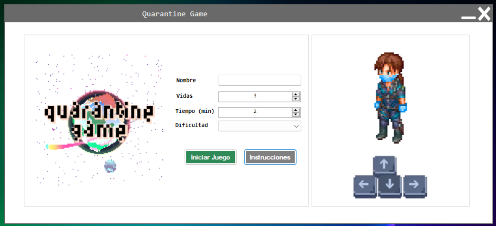
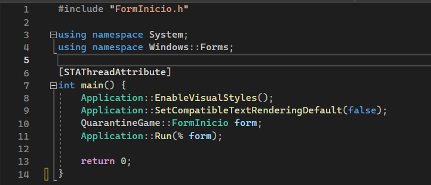
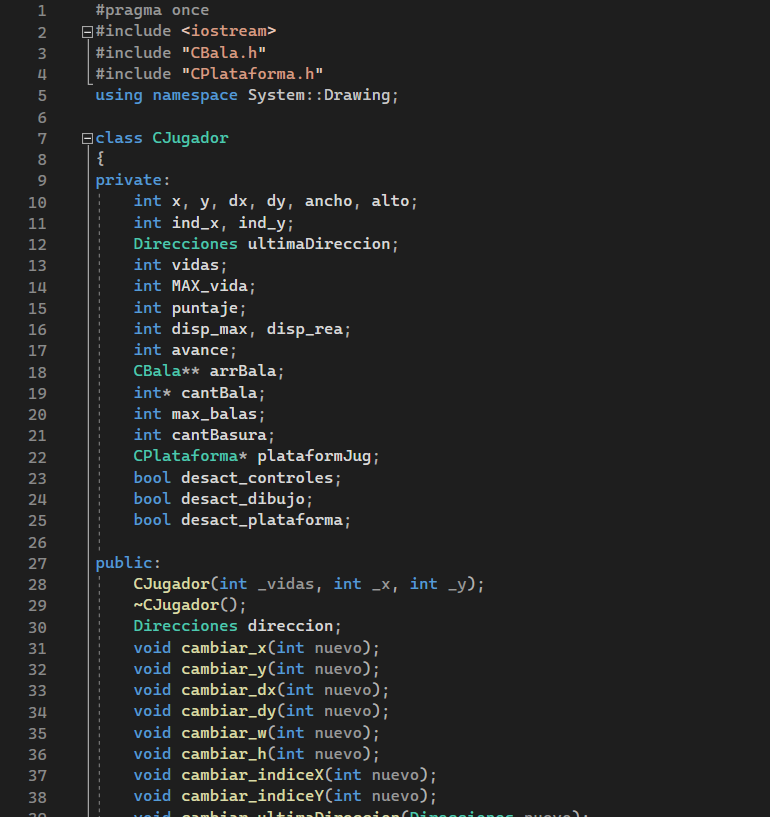
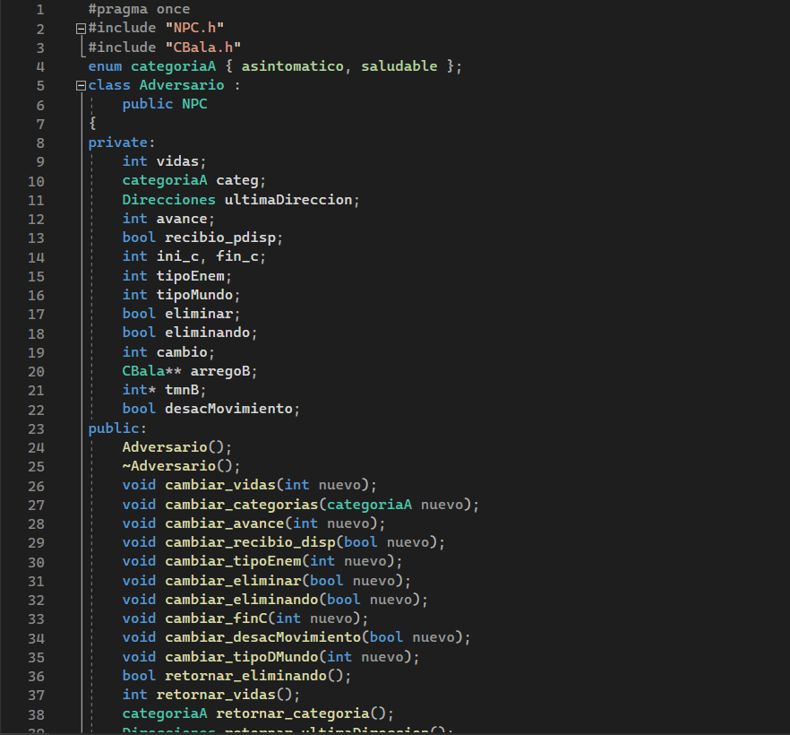
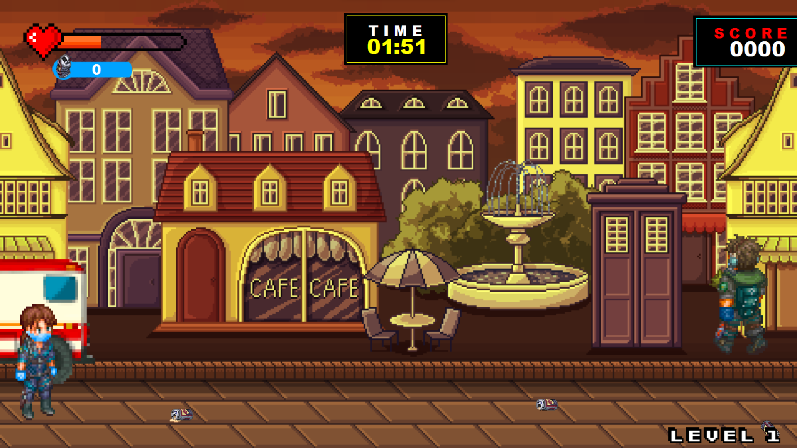
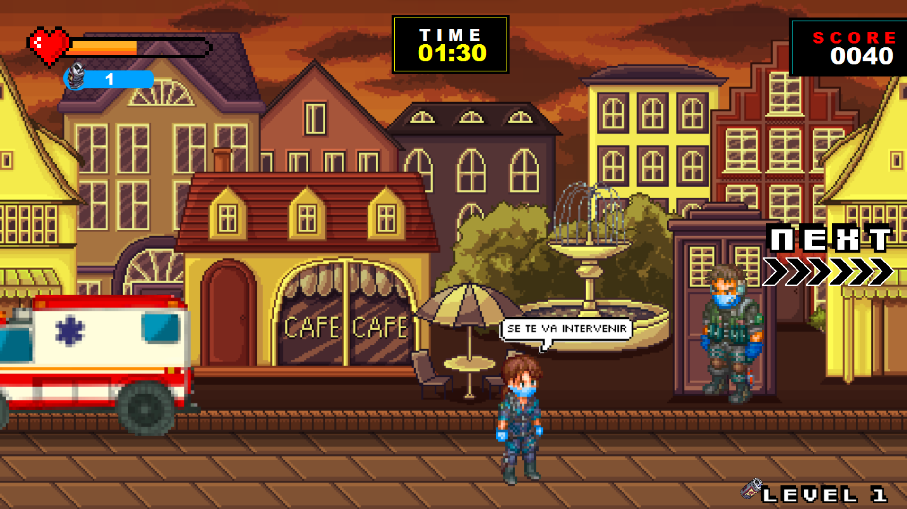
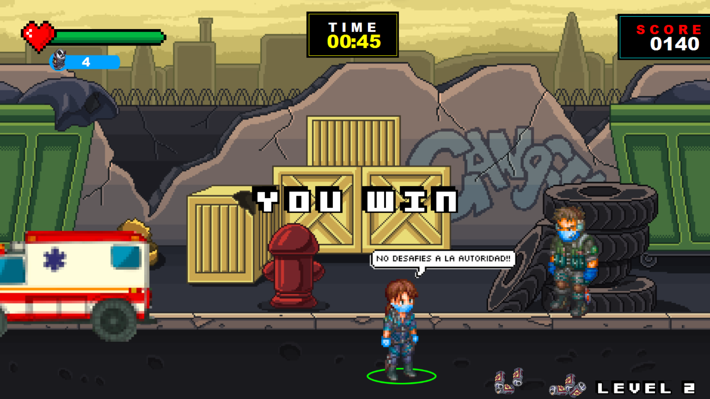
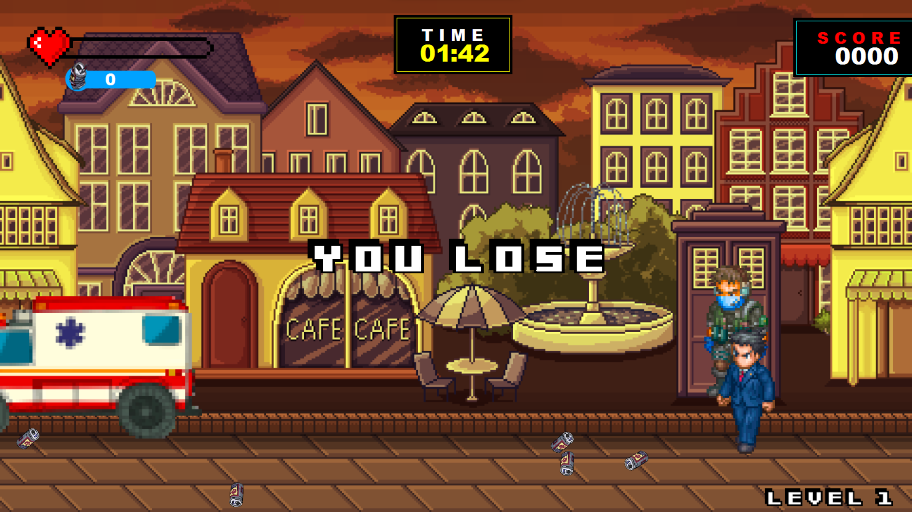

# Quarantine Game
QuarantineGame is a game created for the Programming II course in the Software Engineering program. The objective of the game was to raise awareness within the community about the use of masks, compliance with social distancing obligations, and to provide recommendations to avoid infections. Additionally, the goal was for us students to apply our knowledge of Object-Oriented Programming (OOP) in the development of the solution.

## Tools and Technologies
+ Language: C++
+ IDE: Visual Studio Code
+ Sprites: Photoshop && Web Sites
+ Sound: Own Production

## Code Captures
Below are some screenshots of the game code.

### FormInicio
It is the main file of the game. Some configurations are made for a better rendering and visualization of the game, an instance of the game is initialized and the application is run.

### CJugador
It is the file that contains the definition of the CJugador class. Having defined its necessary attributes and methods and adapting its encapsulation.

### CEnemigo
It is the file that contains the definition of the CEnemy class. It also contains its attributes and methods properly encapsulated. On the other hand, as you can see in the image, this class inherits from the NPC class.

## Game Screenshots

## Credits
+ Heber Cordova Jimenez: Developer
+ Alejandro Medrano Jacobo: Developer && Design
+ Felix Peña Albino: Sound